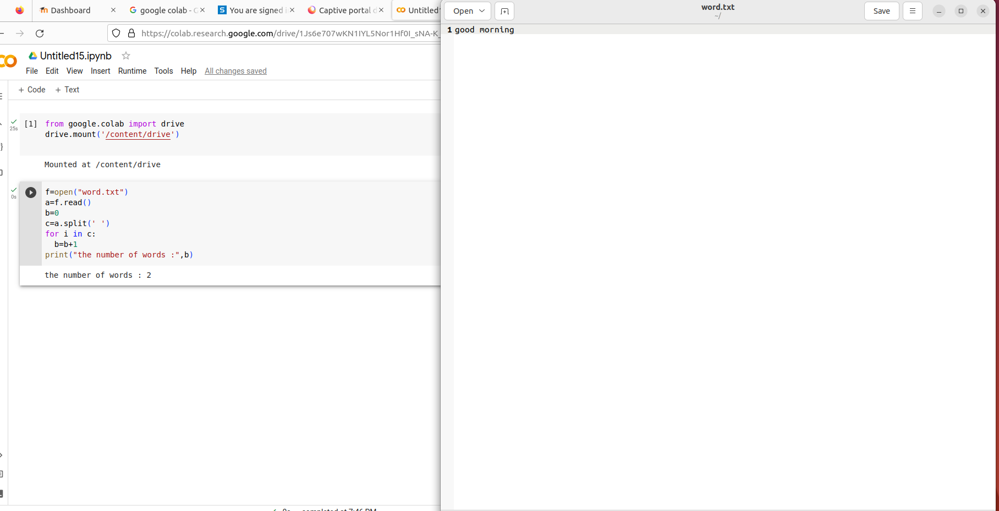

# Word-count
## AIM:
To write a python program for getting the word count from a text.
## EQUIPEMENT'S REQUIRED: 
PC
Anaconda - Python 3.7
## ALGORITHM: 
### Step 1:
Mount your colab with your drive.

### Step 2: 
Open your text file in python code runner.
 
### Step 3: 
Read the file and split the words seperately using split().

### Step 4:  
Count the number of words in text file using for loop.

### Step 5: 
End the program

## PROGRAM:
```python
# To write a program for getting the word count from a text.
# developed by: shyam kumar
# reference number: 23004557
from google.colab import drive
drive.mount('/content/drive')

f=open("word.txt")
a=f.read()
b=0
c=a.split(' ')
for i in c:
  b=b+1
print("the number of words :",b)
```

### OUTPUT:



## RESULT:
Thus the program is written to find the word count from a text.
